## 📌 Index
1. [Screenshots](#screenshots)
2. [APK](#apk)
3. [Demo Recording](#demo-recording)
4. [Module Overview](#module-overview)  
5. [Architecture](#architecture)  
6. [Module Dependency Graph](#module-dependency-graph)  
7. [App Navigation Flow](#app-navigation-flow)  
8. [Feature Data Flows](#feature-data-flows)  
9. [ViewModel State Management](#viewmodel-state-management)  
10. [Network Layer](#network-layer)  
11. [Dependency Injection](#dependency-injection)  
12. [Tech Stack](#tech-stack) 

## Screenshots
| 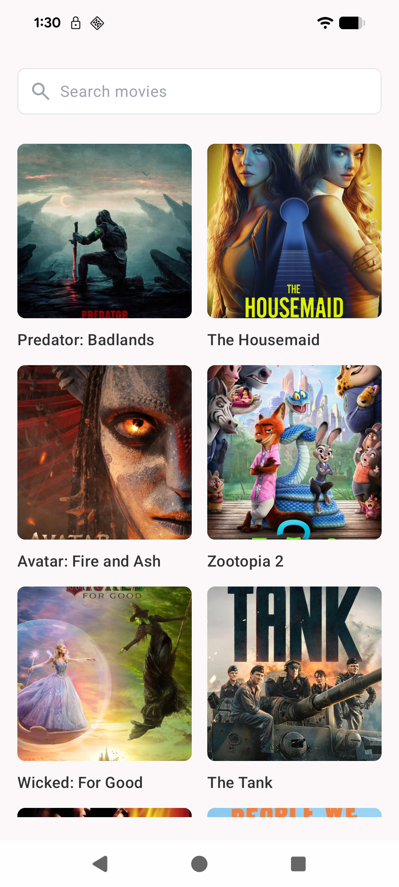 | 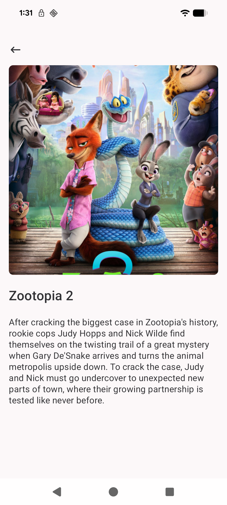 |
| --- | --- |
| 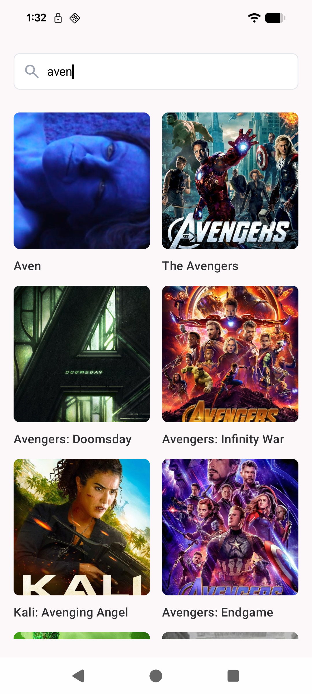 | 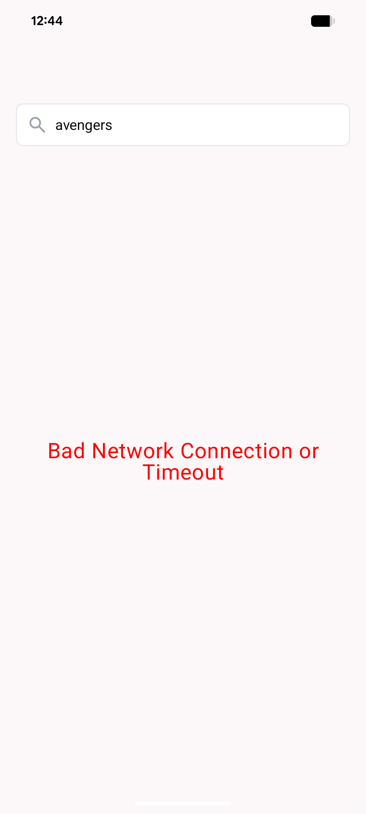 |

---

## APK
[Download filmy apk](assets/app-debug.apk)

---

## Demo Recording


https://github.com/user-attachments/assets/22fcfce8-86ff-424e-a976-d12e23231dac


[Download recording](assets/recording.mp4)

## Module Overview

```
app
├── core:model
├── core:network
├── core:navigation
├── core:ui
├── feature:search
└── feature:movie_details
```

Each module has a single responsibility and communicates via abstractions, ensuring scalability and testability.

---

## Architecture

The app follows Clean Architecture with feature-based modularization:

* Presentation → Jetpack Compose + ViewModel
* Domain → UseCases + Repository interfaces
* Data → Repository implementations, mappers
* Core modules → Shared logic (network, UI theme, navigation, models)

---

## Module Dependency Graph

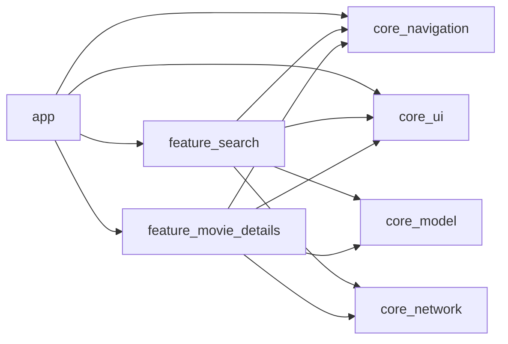

---

## App Navigation Flow

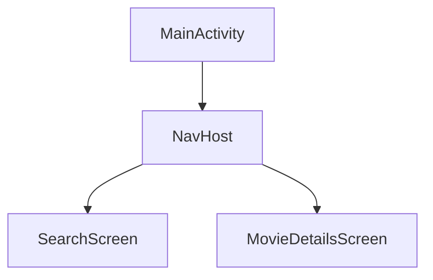

---

## Feature: Search/Trending – Data Flow

### Trending Movies
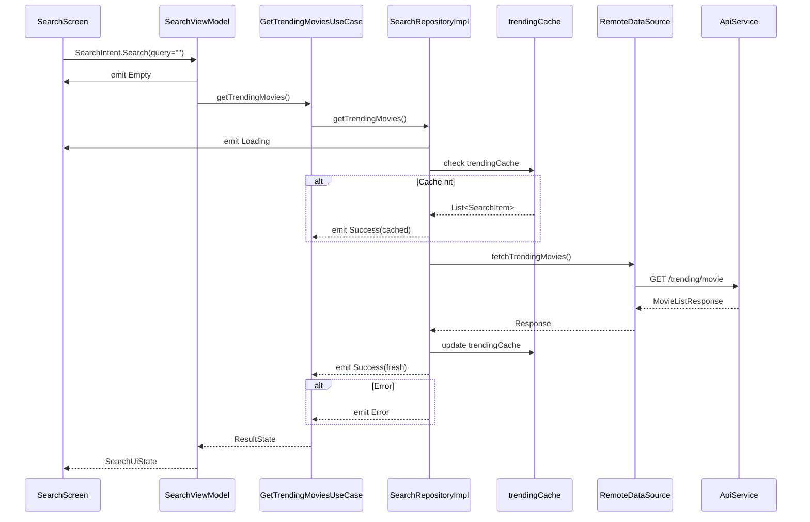
---

### Search Movies
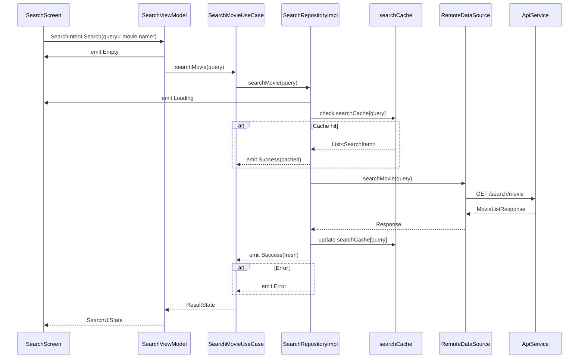

## Feature: Movie Details – Data Flow

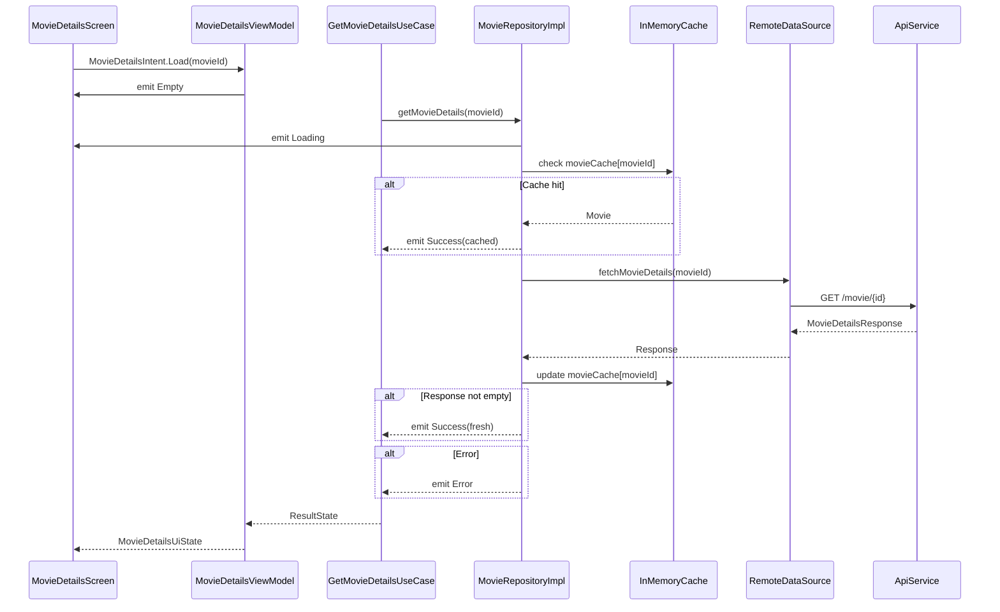

---

## ViewModel State Management

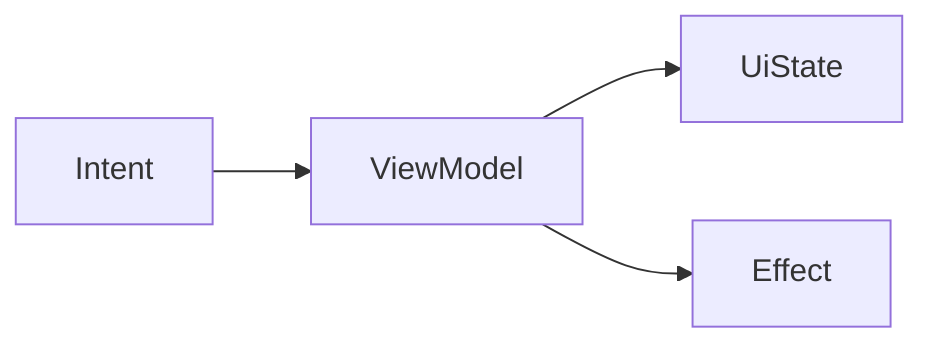

---

## Network Layer

```
ApiService
   ↓
RemoteDataSource
   ↓
Repository
```

## Dependency Injection

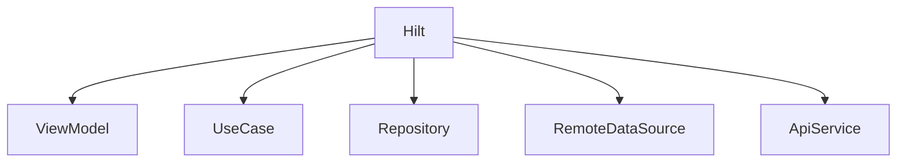

---

## Tech Stack
* Kotlin 2.x
* Jetpack Compose
* Navigation Compose
* Hilt
* Retrofit 3
* Coil
* Clean Architecture
* Multi-module Gradle setup

---

Author: Sidharth Mudgil
