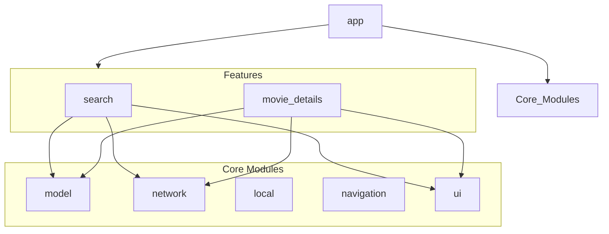
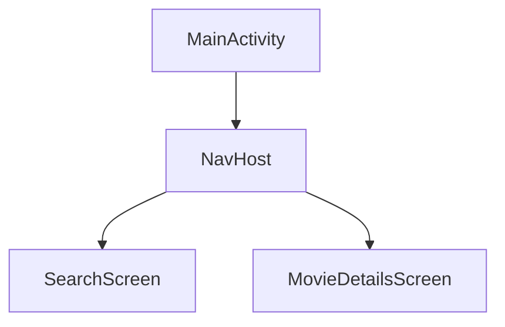
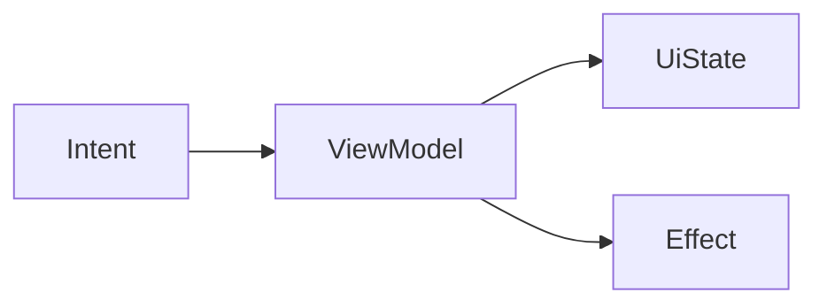
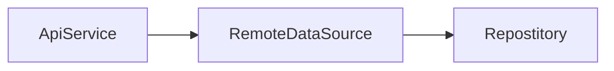
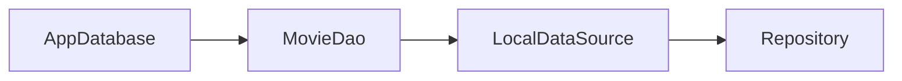
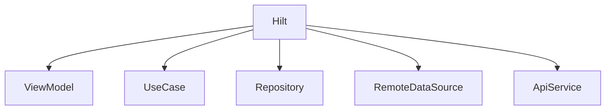
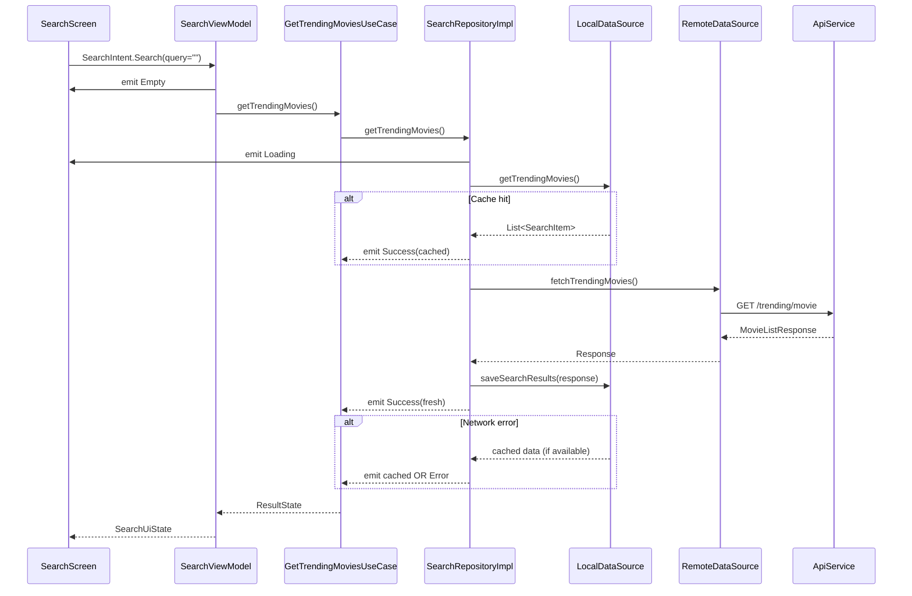
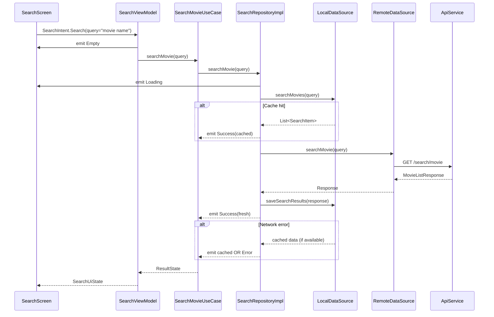
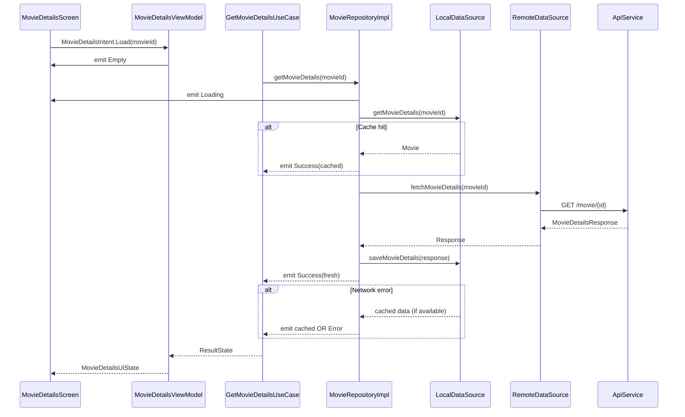

# Index
1. [Overview](#overview)
2. [Tech Details](#tech-details)
3. [Sequence Diagrams](#sequence-diagrams)

# Overview

### Screenshots
|  |  |  |  |
| --- | --- | --- | --- |

### Demo Recording
https://github.com/user-attachments/assets/db8bd383-7edf-4293-9401-1c0c0bac9255


[Download Apk](assets/app-debug.apk)
[Download Recording](assets/recording.mp4)

---

# Tech Details

### Tech Stack
* Kotlin 2.x
* Jetpack Compose
* Navigation Compose
* Hilt
* Retrofit 3
* Room
* Coil
* Clean Architecture
* Multi-module Gradle setup

### Architecture

```
app
├── core:model
├── core:network
├── core:local
├── core:navigation
├── core:ui
├── feature:search
└── feature:movie_details
```



Each module has a single responsibility and communicates via abstractions, ensuring scalability and testability.

The app follows Clean Architecture with feature-based modularization:

* Presentation → Jetpack Compose + ViewModel
* Domain → UseCases + Repository interfaces
* Data → Repository implementations, mappers
* **Core modules**
  - `core:network` → Remote API access
  - `core:local` → Local cache & persistence
  - `core:model`, `core:ui`, `core:navigation`

---

---

### Navigation Graph



### State Management



---

### Network Layer



---

### Local Layer



---

### Dependency Injection



---

# Sequence Diagrams

### Trending Movies

---

### Search Movies


### Movie Details



---

Author: Sidharth Mudgil
